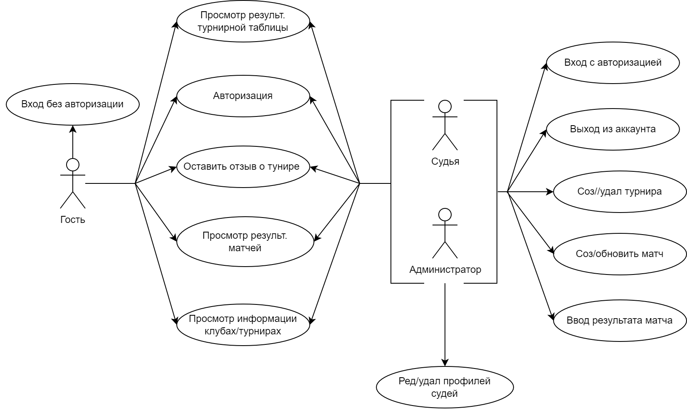
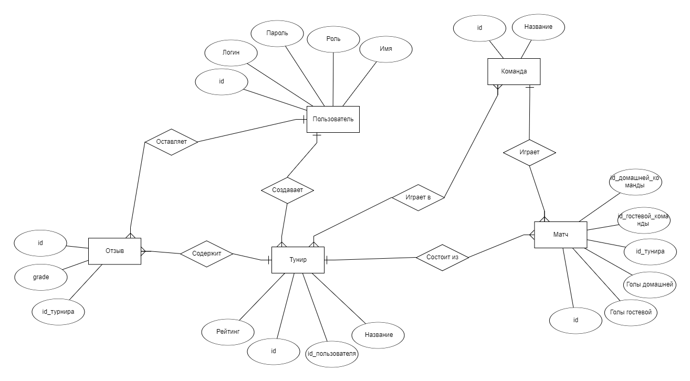
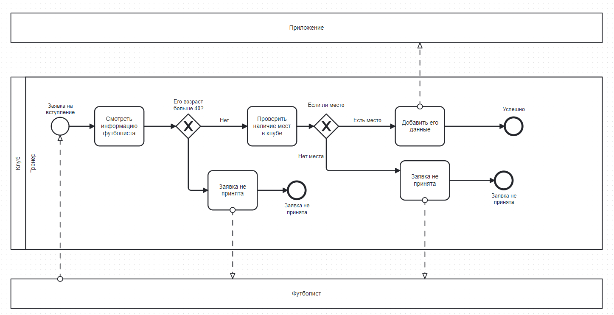
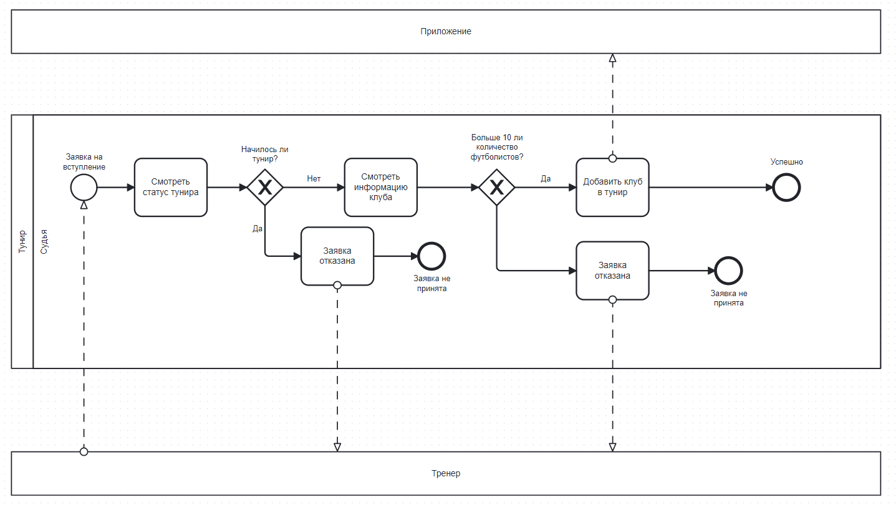

## 1. Название проекта

**Приложение для организации футболных туниров**

## 2. Краткое описание идеи проекта

Разработка удобной платформы для футболтных сообществ, позволяя создавать и управлять тунирами с минимальными усилями. Там пользователи могут легко создавать тунир, состовлять расписание матчей, вводить результаты...Необходимо создать приложение, чтобы упростить процесс управления футбольнами турнирами.

## 3. Краткое описание предметной области

Данное приложение предназначенно для огранизации футбольных туниров.

Предметная область включает в себя следующие сущности:

1. Пользователь
2. Тунир
3. Команда
4. Матч
5. Отзыв

Роли:

1. Гость
2. Судья
3. Администратор

## 4. Краткий анализ аналогичних решений

| Название       | Просмотр/Создание расписание игр | Создание тунира | Запрос на регистрации |
| -------------- | -------------------------------- | --------------- | --------------------- |
| Soccer Manager | -                                | +               | -                     |
| Top Eleven     | +                                | -               | -                     |
| Team Snap      | -                                | +               | +                     |
| Мой проект     | +                                | +               | +                     |

## 5. Краткое обоснование целесообразности и актуальности проекта

Актуальность проекта заключается в необходимости удобного приложения для проведения туниров. Участники и организаторы сталкиваются с трудностями в процессе регистрации и управления, поэтому возникает необходимость информационной системы для тунира: регистрации тунира, просмотра расписание тунира, внесения рузультата матча, просмотра статистики тунира.

## 6. Краткое описание акторов

- Гость - это незарегистрированный пользователь приложения, который имеет ограниченный доступ к его функциям.
- Судья - это пользователь, который ответственен за ввод результатов и статистики матчей, а также за создание тунира.
- Администратор - это пользователь с полными правами доступа к административной панели приложения.

## 7. Use-Case - диаграмма

## 8. ER-диаграмма сущностей

## 9. Пользовательские сценарии

Пользователь может:

1. Авторизоваться
2. Выйти из аккаунта
3. Внести результат матча в таблицу
4. Просмотреть результаты матчей и турнирную таблицу
5. Просмотреть все отзывы турнира
6. Просмотреть все команды
7. Создать новый турнир, добавить в него существующие команды или создать новые
8. Создание расписание тунира
9. Просмотреть расписание тунира
10. Выйти из аккаунта

## 10. Формализация ключевых бизнес-процессов

Вступление в клуб

Вступление в тунир

