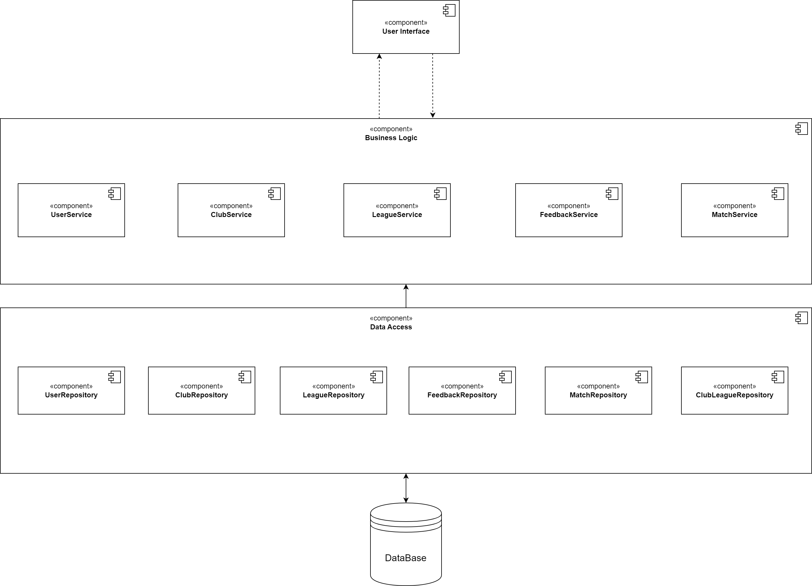
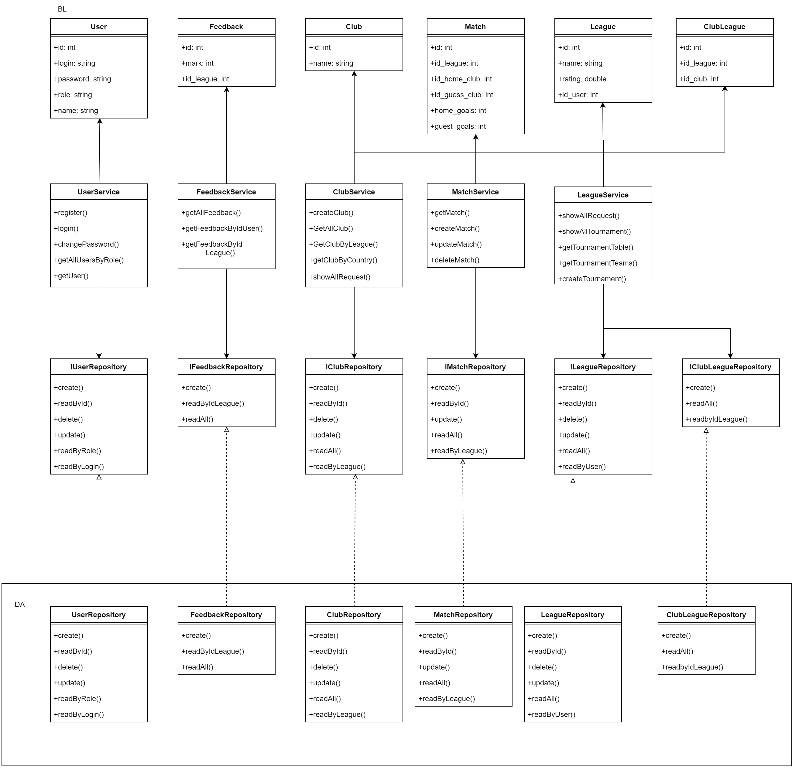

## 1. Tехнологический стек

- Тип приложения: Desktop-App
- Язык программирования: C#
- Framework: .NET, WinForms
- СУБД: PostgresSQL, pgAdmin

## 2. Верхнеуровневое разбиение на компоненты

Верхнеуровневое разбиение на компоненты
Приложение будет состоять из 3 компонентов:

- Компонент реазации UI.
- Компонент реазации бизнес-логики (Business Logic).
- Компонент доступа к данным (Data Access).

## 3. UML диаграмма компонентов

## 4. UML диаграммы классов

