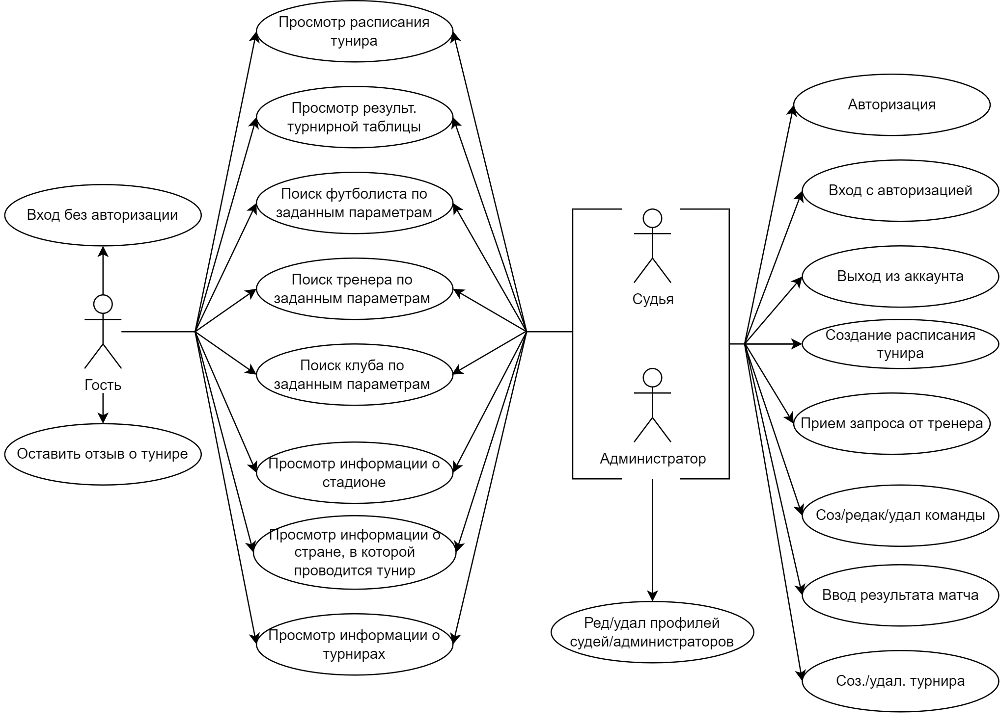
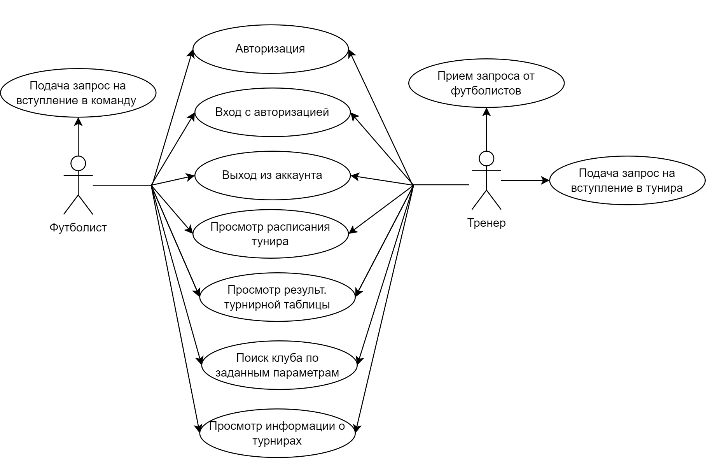

## 1. Название проекта

**Приложение для организации футболных туниров**

## 2. Краткое описание идеи проекта

Разработка удобной платформы для футболтных сообществ, позволяя создавать и управлять тунирами с минимальными усилями. Там пользователи могут легко создавать тунир, состовлять расписание матчей, вводить результаты...Необходимо создать приложение, чтобы упростить процесс управления футбольнами турнирами.

## 3. Краткое описание предметной области

Данное приложение предназначенно для огранизации футбольных туниров.

Предметная область включает в себя следующие сущности:

1. Пользователь
2. Тунир
3. Команда
4. Футболист
5. Тренер
6. Стадион
7. Матч
8. Страна

Роли:

1. Гость
2. Футболист
3. Тренер
4. Судья
5. Администратор

## 4. Краткий анализ аналогичних решений

| Название       | Просмотр/Создание расписание игр | Создание тунира | Запрос на регистрации |
| -------------- | -------------------------------- | --------------- | --------------------- |
| Soccer Manager | -                                | +               | -                     |
| Top Eleven     | +                                | -               | -                     |
| Team Snap      | -                                | +               | +                     |
| Мой проект     | +                                | +               | +                     |

## 5. Краткое обоснование целесообразности и актуальности проекта

Актуальность проекта заключается в необходимости удобного приложения для проведения туниров. Участники и организаторы сталкиваются с трудностями в процессе регистрации и управления, поэтому возникает необходимость информационной системы для тунира: регистрации тунира, просмотра расписание тунира, внесения рузультата матча, просмотра статистики тунира.

## 6. Краткое описание акторов

- Гость - это незарегистрированный пользователь приложения, который имеет ограниченный доступ к его функциям.
- Футболист - зарегистрированный пользователь, который является членом определенной футбольной команды. Он может регистрировать в команду, просматривать расписание матчей, просматривать статистику своей команды...
- Тренер - также зарегистрированный пользователь, который является руководителем футбольной команды.
- Судья - это пользователь, который ответственен за ввод результатов и статистики матчей, а также за создание тунира.
- Администратор - это пользователь с полными правами доступа к административной панели приложения. Он ответственен за создание и управление турнирами, управление пользователями и их правами доступа.

## 7. Use-Case - диаграмма

## 8. ER-диаграмма сущностей

## 9. Пользовательские сценарии

Пользователь может:

1. Авторизоваться
2. Зайти на страницу турнира, просмотреть результаты матчей и турнирную таблицу
3. Зайти на страницу своего турнира и внести результат матча в таблицу
4. Создать новый турнир, добавить в него существующие команды или создать новые
5. Создание расписание тунира
6. Зайти на страницу команды и посмотреть, в каких турнирах она участвует
7. Зайти на страницу команды и подать заявку на вступление в команду
8. Зайти на страницу команды и принять заяку на вступление
9. Зайти на страницу тунира и подать заявку на вступление в тунир.
10. Зайти на страницу тунира и принять заяку на вступление.
11. Зайти на страницу страны и посмотреть, какие турниры проводятся в ней
12. Выйти из аккаунта

## 10. Формализация ключевых бизнес-процессов
